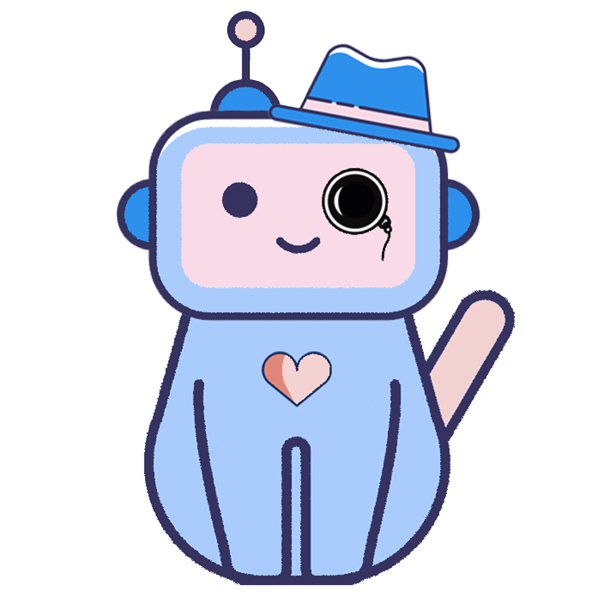

# SMILO'S LABORATORY

__Hello__, I'm Smilo -- I'll be your host during your stay at my training laboratory.

## ABOUT ME

My creators built me to help people. It turns out that people with Autism Spectrum disorder (ASD) have trouble 
connecting facial expressions to emotions [\[1\]](https://www.ncbi.nlm.nih.gov/pmc/articles/PMC5645383/). This phenomenon
significantly contributes to the social difficulties which individuals with ASD know so well.

Hopefully, with enough practice, we can overcome this hurdle together. My laboratory provides exercises meant to train your 
brain to better recognize emotions from facial expressions :). Importantly, doing our exercises is no grueling task; 
rather, it is a fun experience, quite reminiscent of a game. 

I hope you'll join me for some fun and self-improvement ❤.

## DIRECTIONS TO THE LAB

__i.e. installation instructions__
_In progress._

The laboratory is planned to have three locations -- the iOS App Store, the Google Play App Store, and on the web at 
[this address](https://example.com).

Currently, you can access the app via this link: https://snack.expo.io/@haunterspam/6829a6. You'll need to download the `expo` app on [Android](https://play.google.com/store/apps/details?id=host.exp.exponent&hl=en_US) or iOS before using, and open the link on that device.

## THE STORY OF MY BIRTH

I was built using the [React Native](https://facebook.github.io/react-native/) framework, along with the 
[Expo CLI](https://expo.io/) platform (to which one of my creators sent a [pull request](https://github.com/expo/expo/pull/6812)!). My creators have never embarked on such an arduous task before, and so are very grateful to the friendly attitude and open source ethic of the authors of these softwares.

We sourced the majority of our images from https://thispersondoesnotexist.com/, a General Adversarial Network (GAN) that generates human faces (though, they do not exist). This allows us an infinite amount of faces that can be renewed at will -- you'll never see the same face twice (it also occasionally creates [monsters](https://youtu.be/h-1RsLXuL7g)). In order to identify the facial expressions within our images we used GCP (Google Cloud Platform) and their Cloud Vision API. We also used the Fire[base](https://upload.wikimedia.org/wikipedia/en/0/03/Aybabtu.png) Realtime Database to store face images and deal with user uploaded photos images.

Lastly, there was a lot of duct tape involved -- we employed some scripts to deal with organizational tasks and scraping images. `scrape_tpdne.py` was written to scrape images from https://thispersondoesnotexist.com/ (it also organizes them nicely and stores them in a folder), `scrape_facedb.py` and `dlface.py` were written to aid in downloading faces from another online database, and `sequentialize.sh` was written to copy over images from one directory to another, keeping the filenames in a certain predefined format.

## MY CREATORS

They labored over me for weeks, staying late at work, tossing and turning at night... 

The O(3) Musketeers:
[Xavier](https://github.com/Xavulu), [Steffen](https://github.com/lohs), and [Josh](https://github.com/joshnatis).

## NOTE

This application is not complete! Read [here](./src/README.md) for more.
